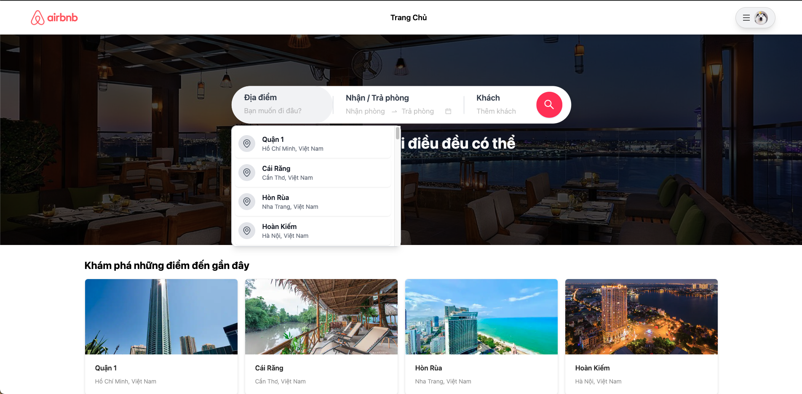
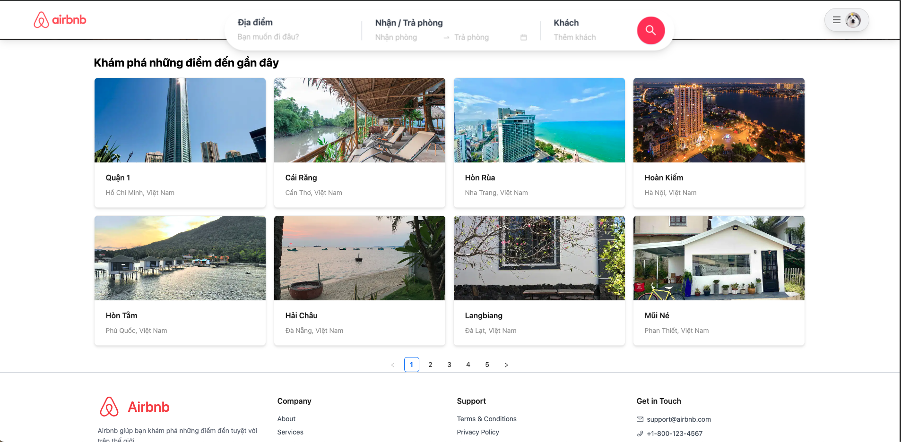
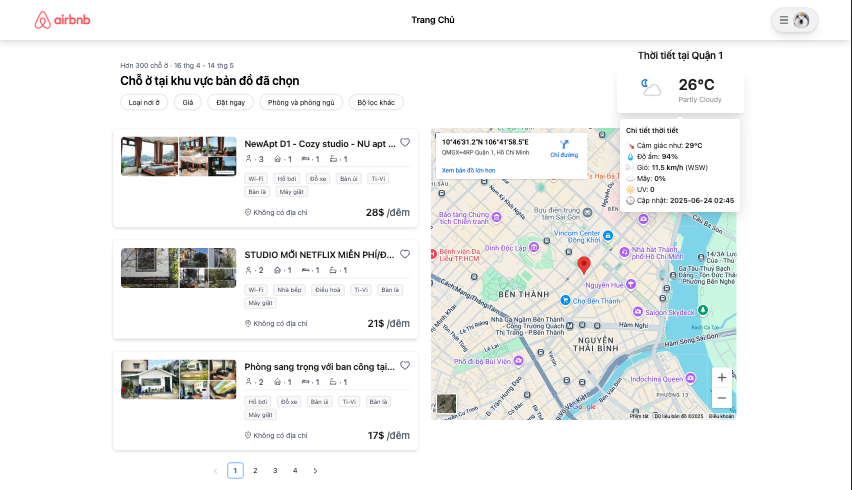
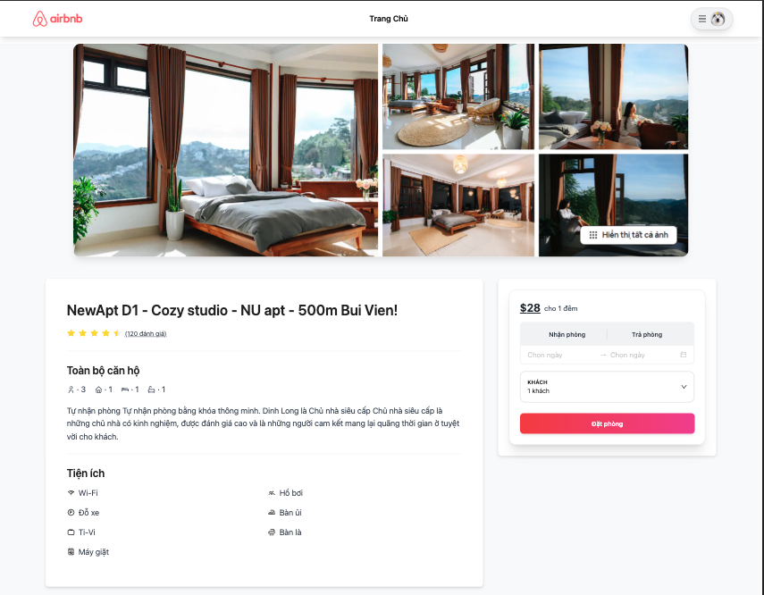
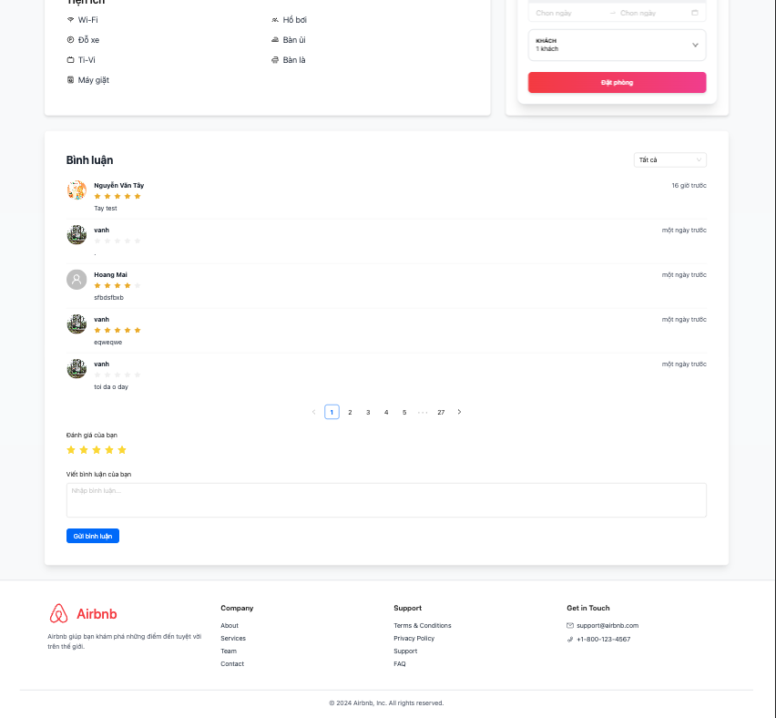
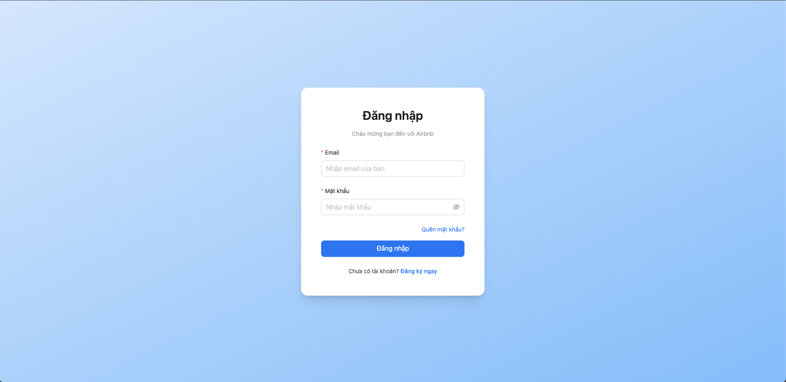
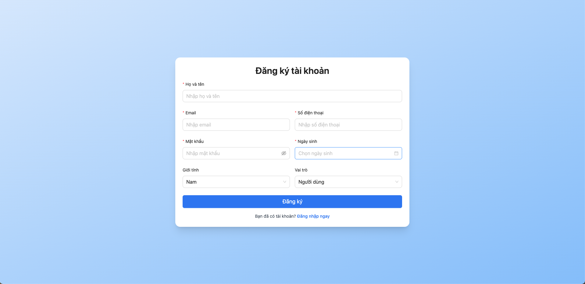
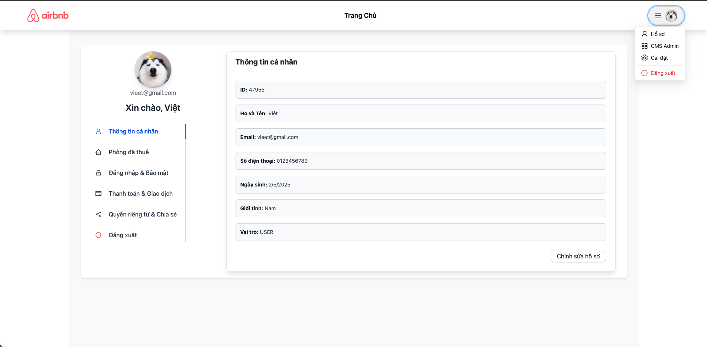
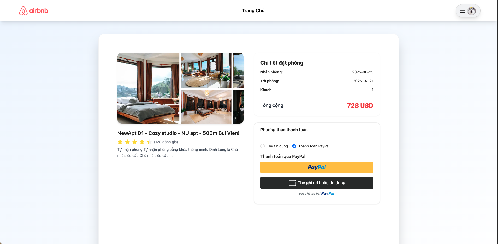

# 🏠 Airbnb Clone

✨ Built a responsive online accommodation booking platform that brings the travel experience to your fingertips! This project features a seamless user interface with powerful functionality, including:

- 🔍 Search: Easily find accommodations with intuitive filters.
- ℹ️ Details: Explore in-depth property details and amenities.
- 📅 Booking: Secure your stay with a smooth booking process.
- 💳 Payment: Safe and reliable payment integration.
- 👤 Profile Management: Manage user profiles with ease.

🚀 Powered by backend APIs for robust performance and scalability, delivering a modern travel booking experience.

## 📸 Screenshots

### 🏠 Home

### 🗺️ Recently viewed places

### 📍 Rooms by location

### 🛏️ Room detail

### ⭐ Reviews

### 🔑 Login

### 📝 Register

### 🙍‍♂️ Profile

### 💳 Payment

## 🛠️ Technologies

- React
- React Router
- Vite
- Tailwind CSS
- Redux
- Redux Toolkit
- Ant Design

## ⚙️ Running Locally

1. Clone the repository
2. Run `npm install`
3. Run `npm run dev`

## 📝 Note

### Account:

- Email: admin01@gmail.com
- Password: Admin01

### Account PayPal:

- Email: nguyenvuongviet@personal.example.com
- Password: nYE7"N[
